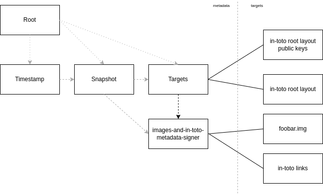
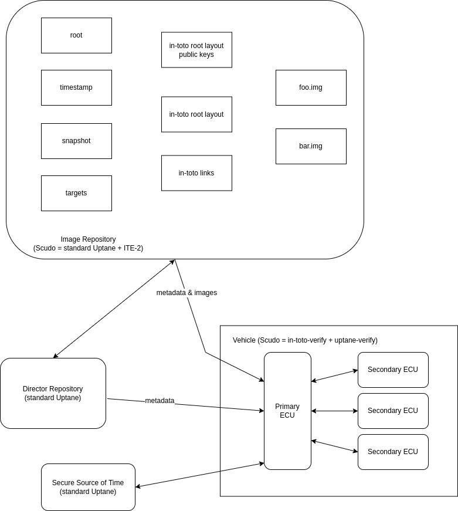
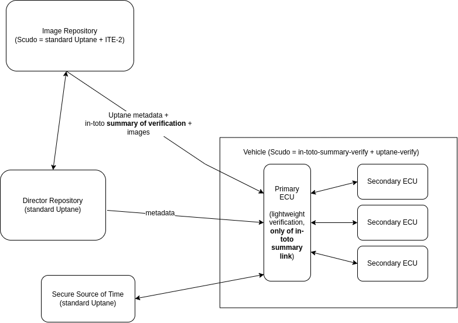
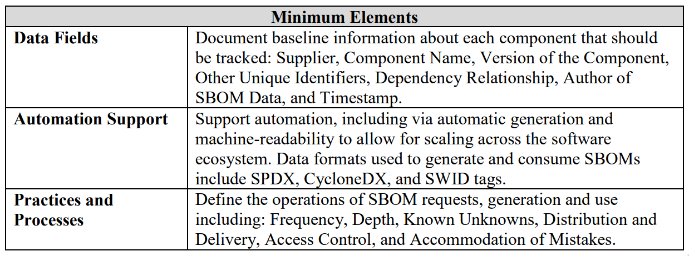

## Table of Contents

   * [Executive Summary](#executive-summary)
   * [Introduction](#introduction)
   * [Challenges to Securing Software Supply Chains for Vehicles](#challenges-to-securing-software-supply-chains-for-vehicles)
      * [Size and Diversity of Code Bases in Vehicles](#size-and-diversity-of-code-bases-in-vehicles)
      * [Not All ECUs are Created Equal](#not-all-ecus-are-created-equal)
   * [Threat Model for Defending Automotive ECUs Against Software Supply Chain Risks](#threat-model-for-defending-automotive-ecus-against-software-supply-chain-risks)
   * [Current Options for Software Supply Chain Security](#current-options-for-software-supply-chain-security)
      * [Software Bills of Materials](#software-bills-of-materials)
      * [Sigstore](#sigstore)
      * [Grafeas / Kritis](#grafeas--kritis)
      * [in-toto](#in-toto)
   * [Scudo: A Proposal for Infusing Software Supply Chain Security into Automobiles](#scudo-a-proposal-for-infusing-software-supply-chain-security-into-automobiles)
   * [Meeting Emerging Regulations and Industry Best Practices](#meeting-emerging-regulations-and-industry-best-practices)
      * [U.S. Executive Order 14028](#us-executive-order-14028)
      * [UNECE WP29 R155](#unece-wp29-r155)
      * [UNECE WP29 R156](#unece-wp29-r156)
      * [ISO/SAE 21434](#isosae-21434)
      * [ISO DIS 24089](#iso-dis-24089)
      * [SLSA](#slsa)
   * [Conclusions and Future Work](#conclusions-and-future-work)

## Executive Summary

In the light of the 2020 SolarWinds attack and the identification of potential supply chain vulnerabilities ripe for exploitation, such as [log4j](https://news.yahoo.com/log4j-why-this-massive-security-flaw-impacting-nearly-all-the-internet-222332341.html), companies across all industry sectors have turned their attention to software supply chain security. The need to find solutions quickly is further fueled by rapidly increasing regulations and standards, including President Biden’s U.S.Executive Order 14028. Issued in the spring of 2021, it explicitly calls for improvements in the development, testing, and distribution of software.

The automotive industry has not been immune to the types of attacks described above.  A 2020 article in [Forbes](https://www.forbes.com/sites/stevetengler/2020/06/30/top-25-auto-cybersecurity-hacks-too-many-glass-houses-to-be-throwing-stones/?sh=8a10f2d7f65d) acknowledges that “nearly every (automotive) manufacturer has been hacked.” Several of the incidents mentioned in the article targeted the software running on vehicles that could be used to carry out software supply chain attacks. These would impact significantly more automobiles than targeted attacks on specific vehicles. Therefore, the industry must acknowledge the need for reliable and resilient security measures across all the stages of software development, building, and deployment.

There are a number of open source strategies for securing software supply chains that could possibly be adapted for use on vehicles. As the problem has grown in significance, the developers of these solutions have collaborated to ensure proposed systems can interoperate. Therefore, the optimum solution will likely involve a layered approach in which combined strategies are used.

In this paper, we propose one such solution, Scudo. Scudo combines the compromise resilience and secure delivery protection of the Uptane software update system, with the end-to-end supply chain security offered by in-toto. Uptane has been a component in secure software update systems used by a number of OEMs for the past five years. On the other hand, in-toto is new to the automotive space but has seen significant adoptions by companies such as [Datadog](https://www.datadoghq.com/blog/engineering/secure-publication-of-datadog-agent-integrations-with-tuf-and-in-toto/) in 2018, as well as by open source efforts such as Sigstore, Grafeas, and Reproducible Builds. SolarWinds itself adopted in-toto as part of its recovery from the attack in 2019-20. in-toto is also a core part of SLSA, the industry’s leading software supply chain best practices framework.

This whitepaper introduces Scudo on a high level. A more formal specification will be published as a [Proposed Uptane Revisions and Enhancements (PURE)](https://github.com/uptane/pures/blob/main/pure1.md). The PURE, which is a formal mechanism for proposing changes to the Uptane Standard, will also consider the unique needs of the automotive industry with respect to the challenges these needs may pose to validating software supply chains. It will also present example scenarios using existing, mature in-toto implementations to help OEMs bootstrap the framework for their supply chains.

## Introduction

For many years supply chain security appears to have been something of a [second-tier priority](​​https://www.sonatype.com/hubfs/SSSC-Report-2021_0913_PM_2.pdf?hsLang=en-us) for both software developers and the companies that rely upon their product. It was more common to focus attention on [what happens after](https://medium.com/the-framework-by-tangram-flex/what-is-software-security-e03a5ee7a6b5)  the software is built, through code reviews, penetration testing, and the development and implementation of patches and updates. This type of approach overlooks the very real possibility that, even with all the efforts mentioned above, end users still have no guarantee they are actually installing the application originally conceived as a code base. Over time, this somewhat myopic vision has given malicious actors multiple opportunities to insert malware or damage images. But, recent events have rapidly forced the industry to take a wider perspective on how software security is defined.

To start with, software supply chain attacks are on the rise. According to the [*2021 State of the Software Supply Chain* report](https://www.sonatype.com/hubfs/SSSC-Report-2021_0913_PM_2.pdf?hsLang=en-us), such attacks increased by 650% in 2021. But, the incident that really made both the government and corporate CISOs pay attention was the [2020 Sunburst attack](https://www.cynet.com/attack-techniques-hands-on/sunburst-backdoor-c2-communication-protocol/), that affected more than 100 companies and 9 government agencies. Launched via malware in the Orion software produced by SolarWinds, the attack taught both public and private concerns some hard lessons, such as:

- As software products contain third-party components, program developers are not in complete control of the contents of their products.
- A compromise anywhere in the supply chain, from the source code to installation by the end user, can introduce vulnerabilities into software.
- The very thing designed to protect the security of software—patches and updates that routinely fix vulnerabilities—can also be used to deliver malware that can damage and corrupt.
- Malware can linger undetected for extended periods of time, allowing it to infect every system that touches it. The Sunburst malicious code was part of an update released by SolarWinds in the spring of 2020, yet it was not reported until December of that year.

If there is any upside to this, it is that no one is ignoring supply chain issues anymore.  In the spring of 2021, President Joseph R. Biden issued a number of Executive Orders related to supply chains in the wake of this and other hacks. One of these executive orders, [#14028](https://www.whitehouse.gov/briefing-room/presidential-actions/2021/05/12/executive-order-on-improving-the-nations-cybersecurity/), specifically targets the development, testing, and distribution of software.  This represents a positive step forward and any actions resulting from these orders should reduce the risk to the software supply chain.

Any recommended actions, however, particularly anything mandated by the Federal government, should carefully consider the diverse industries such rules will affect. Solutions must work in a variety of contexts, including the increasingly vulnerable attack surface of automotive electronic control units or ECUs. Securing the supply chain for software updates on vehicles presents a particular challenge for several reasons. First off, an automobile has, on average, some [30,000 individual components](https://knowhow.napaonline.com/how-many-parts-are-in-a-car/), which can be sourced from perhaps hundreds of individual suppliers. Thus, it can be viewed as an extreme example of the risks inherent in the use of third-party party software components mentioned above. The electronic computing units (ECUs) in cars are particularly diverse in suppliers, with one auto executive admitting in 2020 that only [10% of the software](https://spectrum.ieee.org/software-eating-car)  in its vehicles is developed in-house. With so many outside developers committing to the code base of a car, it is difficult to impose a consistent software supply chain protection strategy from company to company, or even from model to model. Similarly, the proprietary orientation of the auto industry presents another challenge. How can one protect a software supply chain without knowing the exact nature of the units you are protecting?

In this whitepaper, we take a closer look at a few approaches available today to address software supply chain insecurities, as well as the qualities any proposed strategy would need to meet to secure updates on the computing units in vehicles. We then propose a strategy called Scudo, an Italian word for shield. Scudo begins with [Uptane](https://uptane.github.io/),  an open and secure software update system design that protects software delivered over-the-air to automobiles, and adds supply chain protection using [in-toto](https://in-toto.io/). The latter is a proven technology that secures the integrity of software supply chains by making it transparent to the user what steps were performed, by whom, and in what order. in-toto has been adopted or integrated into several major open source software projects, including those hosted by the [Cloud Native Computing Foundation](https://cncf.io/) (CNCF) and the [Open Source Security Foundation](https://openssf.org/) (OpenSSF), both part of the [Linux Foundation](https://linuxfoundation.org/). in-toto has been implemented in different languages like Python, Golang, Java, and Rust, and is part of crucial security projects,  such as [Reproducible Builds](https://reproducible-builds.org/) and [Sigstore](https://www.sigstore.dev/). The project has been adopted in production by [Datadog](https://www.datadoghq.com/), which has used it to secure its pipelines since 2019. [SolarWinds](https://static.sched.com/hosted_files/supplychainsecurityconna21/df/SupplyChainCon-TrevorRosen-Keynote.pdf) adopted in-toto and redesigned their build pipelines after the SUNBURST attack came to light. in-toto also has integrations and support in various other open source projects, such as  [Grafeas](https://grafeas.io), [Kubesec](https://kubesec.io/), and [rebuilderd](https://rebuilderd.com).

By combining the transparency and accountability of in-toto with the compromise resilience and other security features of Uptane, Scudo can better equip automobiles to defend against the increasing likelihood of a hack. Consider that in March of 2022, [Toyota was forced to shut down 28 assembly lines](https://www.reuters.com/markets/stocks/toyota-shares-fall-after-domestic-factory-suspension-2022-03-01/) at 14 plants in Japan for a full day when one of its suppliers found a server had been infected by a virus. Shutting down for one day affected the output of around 13,000 vehicles. For suppliers that provide OTA updates, a server compromise such as this would instead mean compromised software making its way into vehicles already on the road.

We support our proposal that Scudo can provide the necessary supply chain support for automobiles by sharing a case study of a successful integration of in-toto into The Update Framework (TUF), Uptane’s parent project. We then discuss what modifications might  be needed for this TUF/in-toto model, also referred to as the in-toto Enhancement (ITE) 2 model, to work with Uptane. Lastly, we briefly address how Scudo can meet the actions called for in the Executive Orders referenced above, as well as in international regulations such as UNECE WP29 R155, standards like ISO/SAE 21434 Road Vehicle Cybersecurity, and industry best practices like SLSA.

## Challenges to Securing Software Supply Chains for Vehicles

The need for software supply chain security in the automotive industry could not be clearer. Not only are standards and government mandates pushing things forward, but so are the attacks themselves. A 2020 article in [Forbes](https://www.forbes.com/sites/stevetengler/2020/06/30/top-25-auto-cybersecurity-hacks-too-many-glass-houses-to-be-throwing-stones/?sh=8a10f2d7f65d) acknowledges that “nearly every (automotive) manufacturer has been hacked” in some manner. While the industry should work harder to prevent these hacks, reality suggests the attacks will come, and so securing the software supply chain means making all servers in a piece of software’s lifecycle resilient to attacks. The same article quotes an anonymous source from the industry as saying “at some point a brand will experience a massive hack, and when they go bankrupt, that will be the true wake-up call.” The prodding of new legislation and standards will hopefully spur the needed action before this harsh scenario plays out. Nevertheless, no matter what happens, with compromise resilient technologies, companies can recover after attacks and ensure that vehicles on the road remain secure without relying on expensive recalls.

But, as alluded to earlier, achieving a successful supply chain security strategy for the auto industry will likely require some alteration in practices.  Concerns about the protection of intellectual property in this business arena tends to limit sharing of best practices, a crucial step in achieving a secure standard. In addition, any security strategy will also need to take into account a number of mechanical factors common to the industry.

#### Size and Diversity of Code Bases in Vehicles

The sheer size of the code base in an average vehicle can be as much as 100 million lines of code. For the sake of comparison, one [author](https://argus-sec.com/attention-vehicle-manufacturers-the-vulnerability-management-countdown-has-begun/) equates the number to “twice as much as Windows 10, and 250 times more than the original space shuttle.” The fact that much of that code is being written by outside suppliers complicates the development and implementation of supply chain strategies even further, as it means trusting others to ensure the quality and security of the code. For a supply chain solution to work in this context, it must be resilient enough to withstand the actions of developers at other firms who may have malicious intentions. It would also need to be conscious of dependency issues that become harder to negotiate  when code from multiple sources is used.

#### Not All ECUs are Created Equal

There is wide variation across these components in terms of  resources. A telematics or infotainment unit will likely have an operating system that supports connectivity, convenience functions, and downloadable software applications to integrate new functions in the system. A smaller, single-task ECU, such as a door lock actuator, will be slow, will lack the memory to do multiple cryptographic verifications and will store more than a few KBs of state (which may be needed for Uptane’s full verification), and will have no external network connection.

The Uptane specification was initially designed to accommodate many of the idiosyncrasies of  delivering updates to vehicles. As such, it serves as a solid base on which to build a supply chain framework for the auto industry. But, a few other elements need to be added. For starters, there must be greater transparency, starting as early as when the initial code is written. Transparency, in this setting means making the entire history of a software product accessible, including who worked on the product and whether they had permission to do so. The ability to track “component metadata, enabling mapping to other sources of information, and tying the metadata to software as it moves down the supply chain and is deployed,” is a key element in the Biden Administration’s plan for addressing software vulnerabilities.

In addition to accounting for the challenges elaborated above, any supply chain framework for this sector must be flexible enough to work on a variety of different configurations, including on older legacy systems where little may be known about each individual component.

## Threat Model for Defending Automotive ECUs Against Software Supply Chain Risks

Uptane was created to defend against a host of potential threats that can occur when a car receives software updates. Yet, most supply chain attack issues occur earlier in the lifecycle of a piece of software. Hence, we needed to devise a threat model that could get that software product to its secure installation via Uptane without any tampering. in-toto was designed to retain the maximum amount of security that is practical by minimizing the impact of any potential threats along the supply chain. Using the threat model proposed by Torres-Arias et al. (2019) as a starting point, we present the following series of attacker scenarios that Scudo would need to defend against.

Most of these scenarios stem from the aforementioned decentralized nature of automotive manufacturing, and the complexity of a car’s code base. With so many lines of codes being delivered by so many independent manufacturers, this arena is ripe for both malicious tampering and for the accidental creation of potentially exploitable vulnerabilities.

- Add a new action in-between two elements of the software supply chain that changes the input of a step. The most obvious scenario here would be a malicious actor in the packaging step inserting malware via a backdoor. The fact that suppliers often create components for multiple OEMs means this would be a relatively easy way to target thousands of vehicles with very little effort.
- Replacing a step, such as software compilation, perhaps by compromising or coercing the party that usually performs that step.
- Delivering a product for which not all steps have been performed. For example a vulnerability scanner or source code audit may be skipped to hide the presence of a compromise. Given the complex nature of the way software is prepared, it is difficult to ensure all the boxes have been ticked off at the design or packaging stages for a particular unit. If an action has been missed, it would be hard to detect and correct.
- Including outdated or vulnerable elements in the software supply chain. An attacker could force the final product to use a known-vulnerable version of a third party dependency rather than the fixed version.

As Scudo is an extension of Uptane, the [attack scenarios pertaining to Uptane alone](https://uptane.github.io/attacks.html) are also defended against.

*Out of scope:*
- **Drop-request attack,** in which network traffic outside or inside the vehicle is blocked to prevent an ECU from receiving any updates. Though Scudo does not directly address this, users will be notified if this attack is detected.
- **Denial of Service attack**, which prevent a vehicle from installing updates by blocking the vehicle connection to the internet or one or more update servers. Scudo will detect this attack and report it to users.
- **Physical access to the vehicle**, which could allow an attacker to tamper with or replace the hardware on which software is running.
- **Compromise of a threshold** of Uptane and in-toto root keys, though Scudo’s design reduces the likelihood of such a compromise through the use of thresholds and offline keys.

## Current Options for Software Supply Chain Security

A number of technologies implemented for other supply chain applications over the past few years could be considered for the automotive sector. We highlight a few of these strategies in this section. Each technology listed here provides an able solution to the part of the large software supply chain security problem considered in its scope, and several are complementary to each other. The open source nature of their development has also meant that there are existing integrations that permit them to work together.

A commonality for most of these options is that they build security through improved transparency and auditability. As such, they feature techniques for gathering, sharing, and storing relevant information.

#### Software Bills of Materials

A Software Bill of Materials (SBoM) is a list of all the components that went into the writing, compiling, testing, packaging and distribution of a piece of software. [Wikipedia](https://en.wikipedia.org/wiki/Software_bill_of_materials) likens it to “a list of ingredients on food packaging: where you might consult a label to avoid foods that may cause an allergy, SBoMs can help organizations or persons avoid consumption of software that could harm them.” SBoMs place all the relevant data about a software build into an accessible piece of software, making it much easier to track and fix vulnerable components. As such, they are mentioned prominently in many of the U.S. government responses to the Biden Executive Orders, including on the website for the [Cybersecurity and Infrastructure Security Agency](https://www.cisa.gov/sbom), which labels SBoMs as “a key building block in software security and software supply chain risk management.”

One example of an SBoM format is the open source [Software Package Data Exchange](https://spdx.dev/) (SPDX) specification, which was recently published as ISO/IEC 5962:2021. SPDX provides a baseline format for sharing components, licenses, copyrights and security standards. Because it offers a common standard, it can be used by distinct stakeholders. Another SBoM example is [CycloneDX](https://cyclonedx.org/), an open source standard from the Open Web Application Security Project® (OWASP) designed for use in application security contexts and supply chain component analysis. Most recently, CycloneDX added the ability to communicate vulnerabilities and their exploitability for software defined in a bill of materials. Known as the Vulnerability Exploitability Exchange (VEX), the company notes that, in tandem with SBoMs, VEX “forms a comprehensive view of possible risk.”

Though designed for a somewhat different purpose, [Software Identification tags](https://csrc.nist.gov/projects/Software-Identification-SWID), or SWIDs, can also function as SBoMs. SWID tags are XML files that can contain such data as the files and cryptographic hashes for the constituent artifact, and  provenance information about both the creator of the tag and the software components. Each SWID tag is unique to only one specific software product, including various versions and releases. (That is, Version 1.2 of a release would have a different SWID than Version 1.3) Collectively, SWIDs can provide a detailed inventory of all components within a system, making them useful for license management, endpoint policy compliance, and inventory management. While there is some interest in utilizing SWIDs in automotive applications, we will not discuss them at length in this paper as they are not specifically designed to avert attacks on the supply chain.

Software Bills of Materials are a key solution to one specific software supply chain security problem, that of a lack of transparency and traceability of components in a specific software product. They enable the developers of a piece of software to react quickly when a new vulnerability is discovered, à la the [log4j](https://news.yahoo.com/log4j-why-this-massive-security-flaw-impacting-nearly-all-the-internet-222332341.html?guccounter=1) incident by applying patches to all parts of their system using the vulnerable version. In this case, without a clear picture of which of their software components use a vulnerable version of the library, developers cannot guarantee that they can update all of them to use a safe version.

#### Sigstore

Sigstore is a collection of open source projects for software supply chain security. These projects include Rekor, a transparency log for packages, Fulcio, a system for simplifying identity management with short-lived keys, and Cosign, a tool for adding signatures to container images. Together, these technologies allow a user to sign an artifact with a short-lived key and upload this signature to a transparency log. This enables verifiers to ensure consistency of signatures, and confirms that the signatures were made while the short-lived key was valid. This frees the user from needing to store and secure the signing key and minimizes the possibility of key compromise. If the key is lost or stolen after it expires, the attacker can't do anything.

However, Sigstore does not deal with insecurities early in the supply chain, such as the source code or build system. Further, Sigstore relies on the verifier’s ability to access a third-party transparency log, which might be complicated when the clients are automobiles. But, the tools provided by Sigstore address a key issue: ease of use. They make identity management, signing, and storing of signatures more accessible, and these features can be plugged into many other major software supply chain security technologies. Indeed, integrations with Sigstore are plentiful, and the project has been adopted by [several entities](https://github.com/sigstore/friends), such as Amazon, Google, Red Hat, IBM, and VMware. Many open source ecosystems, such as [Maven Central](https://central.sonatype.org/news/20220310_sigstore/), and Linux distributions like Arch Linux are also in the process of adopting Sigstore as well.

#### Grafeas / Kritis

[Grafeas](https://grafeas.io/) is a secure API created by Google that gives build, auditing, and compliance tools a way to store, query or retrieve metadata from any step in the lifecycle of a software product. It provides two types of metadata information. Notes present brief descriptions of particular types of metadata, while occurrences describe how and when any particular note can be found on the resource the metadata represents. Grafeas defines and supports several metadata formats that can be used to collect information about the software supply chain.

By storing data using a uniform schema, Grafeas makes it easy to aggregate metadata by type. It also allows users to carefully control degrees of access for multiple metadata producers and consumers. Metadata files conforming to these formats and stored in a Grafeas server can then be consumed by [Kritis](https://github.com/grafeas/kritis/blob/master/README.md), an admission controller and policy enforcement engine. Both Grafeas and Kritis have been deployed within Google Cloud.

#### in-toto

Like other software supply chain initiatives, the [in-toto framework](https://in-toto.io/) is also dedicated to transparency. It divides the software supply chain into a series of steps, and for each designates a “functionary,” human or otherwise, authorized to perform the required actions. These actions are recorded within a “layout” that defines for each individual step what actions are to be taken and by who. This data is captured in “link” metadata, as are all the artifacts involved. The designated functionary for each step also affixes a cryptographic signature on the link metadata. When the end-user receives the finished product, he or she has a complete record of the product’s journey, and can verify if the software was created according to the designer’s original plans. If there is any divergence from the original layout, a user can pinpoint where the divergence occurred and who is responsible for it.

It is the ability to cryptographically track artifacts through the full supply chain that sets in-toto apart from an SBoM or a project like Grafeas. If one stage of the supply chain is compromised, an SBoM alone is insufficient to detect and track this compromise, and to identify the specific affected artifacts. Likewise, though Grafeas does compile metadata that can be queried for relevant information at different points of software design and development, it cannot track malicious activity that might occur within and between steps without relying on the in-toto semantics integrated into it.

Further, in-toto focuses on providing software supply chain owners with the primitives they need to define and enforce sane policies, ones that make sense for them. These policies can be highly granular, and supply chain owners can define which parts are especially critical, therefore requiring more oversight than others. Well defined policies with sane configurations can go a long way towards blocking the efforts of malicious insiders.

Other supply chain security efforts like Sigstore are complementary to in-toto–they do not directly protect the surfaces in-toto does, but they can be used in conjunction with in-toto as a signing tool (Cosign), and for identity management (Fulcio and Rekor). In fact, Rekor also supports storing in-toto metadata, and this has been extensively used in the primary public instance. An analysis after the first million entries found that [in-toto attestations were the second most popular type of metadata](https://blog.sigstore.dev/celebrating-1-000-000-entries-in-rekor-1950b7c150df).

Another important feature of in-toto’s design is that it recognizes that not all code used in a software product will be developed by one organization. It includes semantics that allow developers to define third party vendors. The code from an external vendor will have its own software supply chain to take into account. This multi-level perspective of the software supply chain is vital to the automotive industry, given how much of the software in a vehicle is written by outside vendors.

Thus, pairing in-toto with Uptane appears to be an optimal starting point for a secure software supply chain framework for automobiles. Yet, it’s important to note that, like Uptane, in-toto can work as a complementary element in other systems. Therefore, it may be possible to produce a multi-layered framework in which more than one solution is employed.  For example, an [interface](https://github.com/in-toto/totoify-grafeas) already exists that converts standard in-toto link files into [Grafeas occurrences](https://github.com/grafeas/grafeas/blob/master/docs/grafeas_concepts.md#occurrences), and allows Grafeas to support in-toto attestations as a type of note and occurrence. Layering in-toto and other complementary supply chain security initiatives, on top of the Uptane framework helps to create “Defense-in-Depth.” As defined by [US NIST IR8183](https://nvlpubs.nist.gov/nistpubs/ir/2017/NIST.IR.8183.pdf) Defense-in-Depth as “the application of multiple countermeasures in a layered or stepwise manner” to “ensure that attacks missed by one technology are caught by another.”  One author compared the strategy to [“sea walls”](https://anchore.com/blog/devsecops-and-defense-in-software-supply-chain-security-coopetion-or-competition/)  to resist “the waves that may eventually crash over the wall.” Combining in-toto and Uptane in Scudo fits well into the overall strategy for a [secure software development framework](https://nvlpubs.nist.gov/nistpubs/SpecialPublications/NIST.SP.800-218-draft.pdf) proposed by the National Institute of Standards and Technology.

In the next section, we present a high-level proposal for Scudo that offers an effective end-to-end defense for automotive ECUs from design to installation. While Uptane is designed to protect the secure delivery of software updates, the addition of in-toto attestations via Scudo will ensure the update images in question are tamper-free prior to their installation.

## Scudo: A Proposal for Infusing Software Supply Chain Security into Automobiles

Our proposal for Scudo uses in-toto to achieve supply chain security, and therefore, we urge readers to familiarize themselves with its [specification](https://github.com/in-toto/docs/blob/master/in-toto-spec.md). As an added plus point, Uptane can be used to bootstrap trust for in-toto’s definition of the supply chain. For Scudo, in-toto ensures that every step in the supply chain is performed by the expected entity, while Uptane ensures that the image and in-toto metadata are properly communicated to the vehicle.

As an example of how Scudo could work, we present a case study in which TUF and in-toto have previously been used in production systems to create end-to-end, verifiably secure build pipelines. in-toto is used to create cryptographic attestations capturing the software development processes. TUF is used to distribute the software artifacts, as well as to securely distribute the in-toto layouts (policies) and public keys required for verification. This is described in detail in an in-toto Enhancement (ITE), which is a mechanism to describe modifications or extensions to the in-toto specification.

[The TUF / in-toto ITE, originally drafted as ITE-2](https://github.com/in-toto/ITE/blob/master/ITE/2/README.adoc), is not written with any specific supply chain in mind, and as such does not mandate any specific structure for the in-toto metadata. It requires a delegated targets role that is used to sign targets metadata for the latest artifacts. Each artifact listed in this delegated role is associated with the in-toto metadata corresponding to the supply chain used to create the artifact. This association is established using the opaque “custom” field allowed by the TUF specification. Meanwhile, the top level targets role signs for the in-toto layouts as well as the public keys used to verify them. The ITE makes some recommendations about key management and the corresponding security properties of each role.

While ITE-2 was authored with TUF in mind, it is straightforward to adapt it to Uptane. One major change from TUF is that Uptane requires a minimum of two repositories–an Image repository and a Director repository. The Image repository contains all the images and metadata created by various suppliers. The Director repository is responsible for communicating with the actual automobile ECUs, deciding which images need to be delivered to the vehicle, and signing metadata for these images.

_Figure 1: An overview of how Uptane semantics can be used to bootstrap and distribute in-toto metadata for the software supply chain. This image is taken from ITE-2, which describes a combination of TUF and in-toto._

If we were to set aside the compulsory existence of a second repository, the rest of this structure closely resembles the “traditional” or expected setup of a system employing TUF. Therefore, Scudo users can choose to implement ITE-2 on either repository, depending on which one is used to download images to the vehicles they build. The resulting in-toto metadata would be stored alongside the images. We recommend implementers apply ITE-2 to the Image repository because, by definition, the Director repository signs targets metadata using online keys, while the top level targets role of the Image repository is typically signed using offline keys. Online keys are not considered secure enough for the role signing for the in-toto root layout and the public keys. Therefore, in the rest of this document, we will assume, but not prescribe, that vehicles fetch their images from the Image repository, where in-toto metadata will also be stored and signed for.

_Figure 2: Scudo modifies the standard Uptane structure by introducing in-toto metadata into one of the repositories. In this example, we have assumed in-toto metadata is stored alongside the images in the Image repository._

In this Scudo model, the upload process would be as follows: When a functionary provides an image and the associated in-toto metadata, a delegated role from the top level targets role signs the image and maps the in-toto metadata to the corresponding in-toto layout.

Once the Director repository decides which images are required and signs targets metadata for them, the vehicle’s primary ECU can fetch the images and all the metadata using the interfaces provided by both the repositories. In this phase, the Director repository can continue signing targets metadata for these images, as per the usual functioning of Uptane with no delegations, and serve the metadata to the automobile. The automobile fetches the image itself from the Image repository along with the repository’s corresponding metadata.

After all the images and metadata from both repositories have been delivered to the automobile’s primary ECU, it can perform a modified version of Uptane’s verification workflow. Consider section [5.4.4.2 of the *Uptane Standard*](https://uptane.github.io/papers/uptane-standard.2.0.0.html). At step 10, after verifying that the Targets metadata of Director and Image repositories match for an image, the in-toto metadata for the image, the root layout, and corresponding public keys are fetched. These must, of course, also match what’s signed in the Uptane/TUF metadata at the Image repository. Then, primary and full verification ECUs may execute the in-toto verification workflow to verify the supply chain of the image.

Performing full in-toto verification can be a resource intensive process for some vehicle ECUs. As a stopgap measure, the Image repository may perform in-toto verification to generate a new “summary link” metadata file. The link can be used as proof that the Image repository performed the complete verification workflow, and the repository can then send this summary link metadata to the vehicle. Using this lightweight verification workflow requires more trust in the Image repository, as it is performing the verification rather than the client, which in this case would be the primary ECU. Further, in these situations, the Image repository could become a single point of failure for thousands of vehicles. So, while this approach can significantly reduce the metadata and verification overhead, it must only be used when full verification is categorically impossible on the vehicle.

_Figure 3: A comparison of two verification workflows. The full verification workflow expects the Primary ECUs (and possibly other full verification ECUs) to also perform in-toto verification. On the other hand, the lightweight workflow requires greater trust in the repository, as it performs only in-toto verification and distributes a summary of that verification. This summary can be verified, in turn, by the automobiles._

Scudo can clearly combine the state of the art in software update security and software supply chain security systems. However, as with any framework that relies on user-defined policies, Scudo also requires that its policies be designed with secure defaults, allowing each part of the software supply chain as much privilege as is absolutely necessary.

## Meeting Emerging Regulations and Industry Best Practices

Any proposed solution for software supply chain security must not only fit the demands of the “here and now,” but also look forward to the types of vehicles that will be produced in both the near and distant future. In addition, the auto industry is a global industry, both in terms of sales and of supply chain sourcing, and so any proposed strategies to protect that chain would also need to meet regulations and standards governing markets in Europe, Asia, and elsewhere in the world.

In terms of worldwide influence, no current or proposed regulation looms larger than [UNECE R155 Road Vehicles: Cybersecurity Engineering](https://unece.org/sites/default/files/2021-03/R155e.pdf), and the companion regulation [UNECE R156 Road Vehicles: Software Update](https://unece.org/sites/default/files/2021-03/R156e.pdf). The United Nations Economic Commission for Europe (UNECE) World Forum for Harmonization of Vehicle Regulations on Cybersecurity and Cyber Security Management Systems is a working group that proposes regulations. R155 and R156 are now mandatory regulations in force in the 54 countries that participate in the 1958 UNECE Transportation Agreements and Conventions, which includes the nations of the EU, the UK, Japan and South Korea. In addition to UNECE R155, a number of pending international standards and regional regulations impacting the auto industry may also dictate future security strategies. 

Though international and national standards do not require compliance in the same manner as adopted regulations, within their related industries approved standards strongly encourage conformance to a specific set of required processes, actions and policies. In the automotive industry, the joint standard developed by SAE International and the International Standards Organization *Road Vehicles: Cybersecurity Engineering* [(ISO/SAE 21434, August 2021)](https://www.iso.org/standard/70918.html), defines cybersecurity process requirements for automotive manufacturers and suppliers to demonstrate adequate cyber-risk management practices throughout vehicle development, production, and post-production, and decommisioning vehicle lifecycle phases. It also encourages the ability to implement over-the-air (OTA) software security fixes (i.e., when vehicles are already on the road). The companion standard currently under development by the International Standards Organization *Road Vehicles: Software Update* [(ISO DIS 24089, January 2022)](https://www.iso.org/standard/77796.html) defines process requirements for automotive manufacturers and suppliers to demonstrate adequate functional safety and cybersecurity management practices for all software update methods, including OTA (over-the-air).  The final ISO 24089 standard is scheduled to be published in December 2022.

In this section, we’ll examine what components a software supply chain system must have to be in compliance with the US Executive Orders, the stipulations of UN R155 and R156, and the best practices of ISO/SAE 21434 and ISO DIS 24089. We’ll then suggest how Scudo might complement a compliance strategy for each of these components. In addition we will look at how our proposed protocol can embody the best practices of both the automotive industry and the computing industry by referencing the aforementioned ISO/SAE 21434 and ISO DIS 24089 standards and the open source Supply chain Levels for Software Artifacts, or SLSA, checklist of standards and controls.

It should be noted that both standards and regulations always take years to write and thus some of these documents were prepared before the current heightened concern about supply chain security. It is still important to understand and consider their impact as standards and regulations are living documents and therefore are periodically revised in response to emerging concerns.

#### U.S. Executive Order 14028

The [U.S. Executive Order 14028](https://www.whitehouse.gov/briefing-room/presidential-actions/2021/05/12/executive-order-on-improving-the-nations-cybersecurity/), signed by the U.S. President on on May 12, 2022, mandates the development of a set of [recommended high-level practices based on established standards, guidance, and secure software development practice documents](https://nvlpubs.nist.gov/nistpubs/SpecialPublications/NIST.SP.800-218.pdf). To identify and promote these practices, several Federal agencies, including the U.S. National Institute of Standards and Technology (NIST), the U.S. National Telecommunications and Information Administration (NTIA), and the U.S. Department of Commerce, were instructed to develop specific parts of an overall strategy.

U.S. NTIA was charged with publishing the “minimum elements” required for an SBoM.  The administration is placing a great emphasis on the use of SBoM’s because it pegs transparency as a core element in improving the security of the software supply chain. An [NTIA/Department of Commerce report](https://www.ntia.doc.gov/files/ntia/publications/sbom_minimum_elements_report.pdf) quotes Executive Order 14028 as saying, “the trust we place in our digital infrastructure should be proportional to how trustworthy and transparent that infrastructure is.”  The document adds that, “transparency is best achieved using an understandable model supported by industry. An SBoM model achieves this systematic sharing by tracking component metadata, enabling mapping to other sources of information, and tying the metadata to software as it moves down the supply chain.”

The NTIA report referenced above, which was published on July 12, 2021, defines an SBoM as a “formal record containing the details and supply chain relationships of various components used in building software,” and the criteria for its minimum elements are listed in Table 1. NTIA also published several related documents throughout 2021, including an *SBOM Tool Classification Taxonomy* (https://www.ntia.gov/files/ntia/publications/ntia_sbom_tooling_taxonomy-2021mar30.pdf), which categorizes different types of SBOM tools. This document can help tool creators and vendors to easily classify their work and help tool users to select available SBOM tools.

_Table 1: The Minimum Elements for an SBOM as defined in The Minimum Elements For a Software Bill of Materials (SBOM) published by the U.S. Department of Commerce, June 12, 2021._

In the fall of 2021, NTIA published a [*Survey of Existing SBOM Formats and Standards - Version 2021*] (https://www.ntia.gov/files/ntia/publications/sbom_formats_survey-version-2021.pdf), which summarizes existing standards, formats, and initiatives for SBOMs to identify the external components and shared libraries used in the construction of software products. It highlights the three key formats of SPDX, CycloneDX, and [SWID](ISO/IEC 19770-2). The stakeholder group analyzed efforts already underway to communicate this information in a machine-readable manner.

NIST has also focused on a more extensive vision of the whole software development life cycle.  In October 2021, US NIST published a major draft update to their fundamental document [SP800-161r1](https://nvlpubs.nist.gov/nistpubs/SpecialPublications/NIST.SP.800-161r1-draft2.pdf) as *Cybersecurity Supply Chain Risk Management Practices for Systems and Organizations (2nd Draft)*. It defines best practices and controls for Cybersecurity Supply Chain Risk Management (C-SCRM) that apply to both information technology (IT) and operational technology (OT) environments, and also includes the Internet of Things (IoT).In a document entitled [Secure Software Development Framework (SSDF) Version 1.1](https://nvlpubs.nist.gov/nistpubs/SpecialPublications/NIST.SP.800-218.pdf), released in February 2022, NIST presents  “a core set of high-level secure software development practices that can be integrated into each software development implementation.” The framework encourages “a linkable, modular approach” to “maximize the potential for flexibility and adoption.” A core vision of NIST’s approach to supply chain security emphasizes modularity of operations, which makes it easier to adapt to a wide number of different use cases.

Thus, two of the key elements called for meeting the demands of Executive Order 14028 are transparency and adaptability. Because the Executive Order is focused on “outcomes of the practices rather than on the tools, techniques, and mechanisms to do so,” it offers supply chain developers a great deal of flexibility to design for specific applications. In short, the Federal government is calling for the development of frameworks that “can be used for any type of software development, regardless of technology, platform, programming language, or operating environment.” Despite all the positives of such an approach, whatever recommendations are put forward must still ensure that key security elements are standardized and consistent.

There is, at this point, no widely used and standardized approach for software supply chain security in the automotive sector. Yet, any proposed solution stands to benefit from the use of approaches that have been vetted under the rigorous review of the open source world, and built by communities that understand the particular difficulties of the market for which it was constructed. Both in-toto and Uptane, Scudo's building blocks, can lay claim to such a background. Furthermore, as stated earlier. our proposed approach allows for layered defense-in-depth and supports the “modularity of operations” recommended by NIST. As such, our proposed module can also support the integration of other security technologies.

#### UNECE WP29 R155

Within the context of this [regulation](https://unece.org/sites/default/files/2021-03/R155e.pdf), supply chain issues can be considered under the larger umbrella of cybersecurity management, which ensures security is “adequately considered, including risks and mitigations.” Compliance with this regulation requires adherence to a series of procedures that demonstrate adequate testing, assessment, and mitigation of any identified flaws.

According to a [release](https://unece.org/media/press/1632) issued by the UN on June 24, 2020, when the new regulation was formally adopted, it represents “the first ever internationally harmonized and binding norms in this area.” The release identifies four areas of primary concern, including “providing safe and secure software updates and ensuring vehicle safety is not compromised, introducing a legal basis for so-called ‘Over-the-Air’ (OTA) updates to on-board vehicle software.”

While this regulation does not specify practices for supply chain security, an annex to a recent  addendum ([Addendum 154-UN Regulation No. 155](https://unece.org/sites/default/files/2021-03/R155e.pdf)) did list several “attack impacts” that could be consequences of a supply chain vulnerability, including “altered software” and “data integrity breaches.” It also includes “threats to vehicles regarding their update procedures” on its list of high-level descriptions of threats and vulnerabilities.

An [assessment of UNECE 29 by Upstream](https://upstream.auto/blog/understanding-the-unece-wp-29-cybersecurity-regulation/), a cybersecurity and data analytics platform serving the auto industry, emphasizes that under this regulation OEMs are responsible for “ensuring that all vehicle components and parts, both hardware and software, are secure.” With such responsibility on the line, a proven track record in securing a wide range of systems, including container and cloud applications makes in-toto an appealing option. Furthermore, with its mandate to “provide safe and secure software updates,” a system based on TUF, which has been documented as a reliable and compromise-resilient defender of software updates, can only be a plus.

#### UNECE WP29 R156

Within the context of this [regulation](https://unece.org/sites/default/files/2021-03/R156e.pdf), supply chain security issues are paramount concerns to ensure that all automotive vehicle functional safety and cybersecurity risks have been identified, analyzed, and eliminated and/or mitigated in both hardware and software automotive components. Compliance with this regulation requires the establishment, maintenance, and performance of quality, configuration, and documentation management, verification and validation, and software update management processes to ensure the integrity and reliability of the hardware and software components in automotive vehicles.

#### ISO/SAE 21434

A joint initiative from two established standards development organizations serving the automotive sector, this standard has been in development for the past four years. As noted in [Upstream Security's 2021 Global Automotive Cybersecurity Report](https://upstream.auto/2021report/), it represents input from OEMs, ECU suppliers, cybersecurity vendors, government regulatory organizations, and more than 100 experts from more than 82 companies based in over 16 countries. The draft was developed in four working groups focusing on risk management, product development, production, operation, maintenance, decommissioning, and process overview.

Like UNECE 29, this standard does not mandate specific security practices to defend the supply chain. As a [writeup in the German edition of Wikipedia](https://de.wikipedia.org/wiki/ISO/SAE_21434) states, “the activities in product development according to the standard are contributed on the basis of a risk assessment, and measures for organizational anchoring are required. Processes are required, but the standard only describes the task of a process, but leaves the design of the process to the companies.” Yet, the standard’s strong emphasis on both risk assessment strategies and threat modeling implies that understanding all potential threats at each step of a product’s development will become essential to compliance. The holistic approach to security made possible by Scudo should contribute greatly to such efforts.

#### ISO DIS 24089

A major international automotive industry effort, this [standard](https://www.iso.org/standard/77796.html) has been in development since July 2019.  It represents input from OEMs, hardware and software suppliers, cybersecurity vendors, government regulatory organizations, and more than 90 voting experts from over 20 ISO member countries.  When the final ISO 24089 is published, conformance with this standard will require the establishment, maintenance, and performance of quality management, configuration management, documentation management, verification and validation, and software update management processes to ensure the integrity and reliability of all software updates to automotive vehicles. 

#### SLSA

[Supply chain Levels for Software Artifacts (SLSA)](https://slsa.dev/) is a series of controls and recommendations that aim to secure the integrity of every link in a given software supply chain. SLSA is designed to be ecosystem agnostic, and instead serves as a common reference to understand the amount of assurances we can make about the supply chain security of a particular piece of software.

SLSA defines four levels, 1 to 4, where level 1 is the easiest to adopt, while level 4 is the hardest but provides the strongest  assurances. Unlike other standards or lists of  best practices common in the industry, SLSA is designed around the idea of using verifiable proof of a particular recommendation or control being in place in a supply chain. These verifiable proofs are in the form of in-toto attestations. The SLSA provenance specification is already in use, while other attestation formats are being actively developed. Scudo’s use of in-toto metadata allows it to be consistent with the assurance levels described in SLSA level 1.

## Conclusions and Future Work

Software supply chain attacks have been on the rise across industries and ecosystems. If it has not happened yet, the automotive industry could be a promising target for nation-state and other attackers because of the sheer numbers of potential victims, and the level of devastation such an attack can cause. For years, software updates in this space have been secured using Uptane. We propose building on the foundation Uptane provides by adding in-toto, an open source framework for securing software supply chains that has been battle tested in non-automotive sectors. We call this combined system Scudo. Scudo is complementary with on-going standards and regulations that aim to secure vehicles from supply chain attacks. It uses existing infrastructure from Uptane to simplify adoption for OEMs.

This document presents a high level architecture for Scudo. A more formal specification will be published as a [Proposed Uptane Revisions and Enhancements (PURE)](https://github.com/uptane/pures/blob/main/pure1.md). The specification released as a PURE, which is a formal mechanism for proposing changes to the Uptane Standard, will also consider the unique needs of the automotive industry, and present example scenarios using existing, mature in-toto implementations to help OEMs bootstrap the framework for their supply chains. Lastly, the specification will acknowledge that automobile ECUs have limited bandwidth and resources, and this needs to be tested and benchmarked. In the PURE, we will present detailed case studies where we look at the bandwidth constraints and different verification models.
